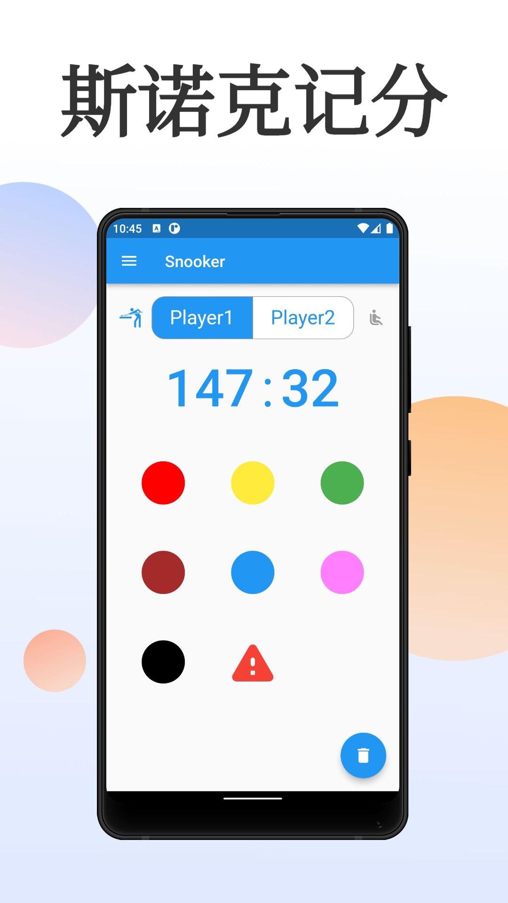

# pool_counter

A score counter for pool, such as snooker and eight-ball.



## How to contribute

```bash
flutter build apk --release
```

If run into issues like:
```java
Execution failed for task ':app:lintVitalRelease'.
> Lint infrastructure error
  Caused by: java.lang.NoClassDefFoundError: com/android/tools/lint/checks/BuiltinIssueRegistry
```

Then may be needed to update *gradle* version.
