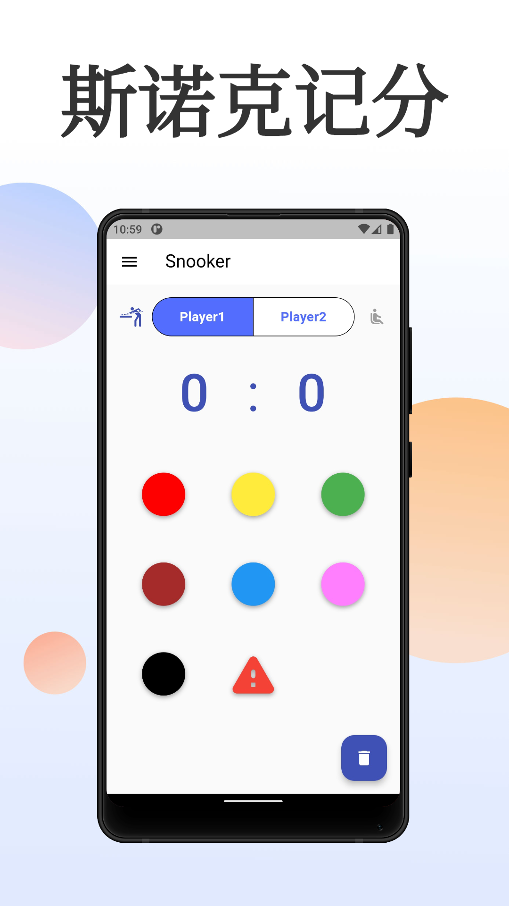

# pool_counter

A score counter for pool, such as snooker and eight-ball.



## How to contribute

### Gen icon

dart run flutter_launcher_icons -f ./flutter_launcher_icons.yaml

### Build

```bash
flutter build apk --release
```

If run into issues like:
```java
Execution failed for task ':app:lintVitalRelease'.
> Lint infrastructure error
  Caused by: java.lang.NoClassDefFoundError: com/android/tools/lint/checks/BuiltinIssueRegistry
```

Then may be needed to update *gradle* version.

### Sign

Follow this: [Signing the app](https://docs.flutter.dev/deployment/android#signing-the-app)
```bash
keytool -genkey -v -keystore ~/upload-keystore.jks -keyalg RSA -keysize 2048 -validity 10000 -alias upload
```

Then run: 
```bash
jarsigner -verbose -keystore ~/android-keystore.jks -signedjar signed.apk CoolApkDevVerify_no_sign.apk upload
```